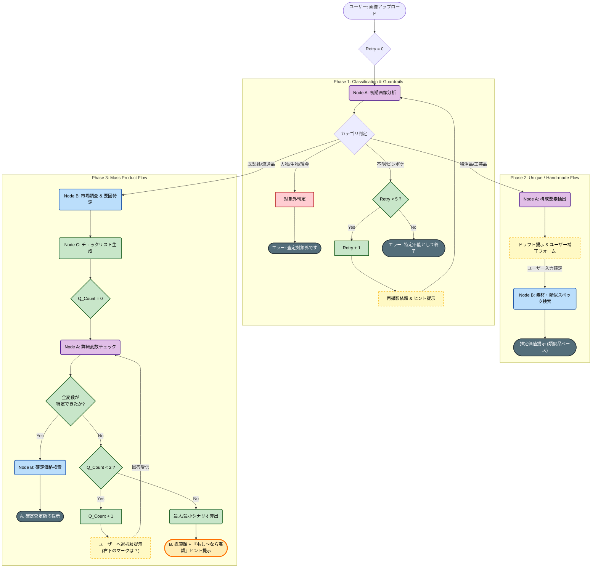

これまでの議論（動的スキーマ、特注品対応、リトライ制限、そして「可能性ヒント」による出口戦略）を全て反映した、**Ojoya AIエージェントの最終設計仕様書**です。

開発チームへの共有資料としてそのままお使いいただける形式でまとめました。

---

# Ojoya AI Valuation Agent - Architecture Specification

## 1. 全体ワークフロー図 (Mermaid)

この図は、画像入力から「確定査定」「概算＋可能性提示」「特注品対応」「エラー」に至るすべてのステートマシンを表しています。



---

## 2. フェーズ別 詳細ロジック仕様

### Phase 1: ガードレールとリトライ

「無駄な処理を省き、リスクを回避する」フェーズです。

* **対象外判定**: 人物の顔、動物、現金、クレジットカード等が写っている場合、即座に終了します（プライバシー/コンプライアンス）。
* **Unknownループ**: 画像が不鮮明な場合、最大5回まで再撮影を促します。
* *ユーザーへのアドバイス例*: 「暗すぎます」「近づきすぎています」「全体を入れてください」


### Phase 2: 特注品・一点物フロー

「AIの限界をユーザーの知識で補う」フェーズです。

* **判定基準**: 型番が存在しないもの（絵画、壺、ハンドメイド家具など）。
* **ドラフト機能**: AIは勝手に決めつけず、「予測」を表示してユーザーに修正させます。
* `素材: [ 木材 (予測) ]` → ユーザーが `[ 黒檀 ]` に修正。


* **Proxy Search**: 修正されたスペックを元に、類似品や素材原価を検索します。

### Phase 3: 既製品フロー（質問制限付き）

「効率的に特定し、夢（可能性）を残す」フェーズです。

* **動的スキーマ**: 検索結果から「価格が変わるポイント」だけをNode Aに見させます。
* **質問制限 (Max 2)**: ユーザー体験を損なわないよう、質問は2回までとします。
* **可能性ヒント (Upside Hint)**:
* 特定しきれなかった場合、ただ「分かりません」とは言いません。
* **「現状は5,000円ですが、もし〇〇（例：初版マーク）があれば、最大150,000円になる可能性があります」** と伝え、ユーザーに再確認のモチベーション（お宝探し感）を提供して終了します。


---

## 3. 重要データのJSONスキーマ

実装時にバックエンド（Lambda等）で扱う主要なJSON構造です。

### A. Vision初期判定 (Node A Output)

```json
{
  "category_type": "mass_product", // mass_product | unique_item | unknown | prohibited
  "item_name": "Pokemon Card Charizard",
  "guardrail_reason": null, // prohibitedの場合に理由が入る
  "retry_advice": null // unknownの場合に「もっと明るく」等が入る
}

```

### B. 最終回答データ (Result Output)

特に `upside_potential` オブジェクトが重要です。

```json
{
  "status": "complete_with_hint", // complete | complete_with_hint | error
  "valuation": {
    "min_price": 5000,
    "max_price": 10000,
    "currency": "JPY",
    "confidence": "medium"
  },
  "display_message": "状態Bランクの一般的な中古相場です。",
  
  // ▼ ここが「可能性ヒント」のためのデータ
  "upside_potential": {
    "has_potential": true,
    "trigger_factor": "No Rarity Symbol (First Edition)", // 何があれば高いか
    "potential_max_price": 150000,
    "user_message": "今回は確認できませんでしたが、もし右下に『マークがない』場合は初版となり、最大15万円前後の可能性があります。"
  }
}

```

この設計により、**「技術的な実現可能性」**と**「ユーザー体験（わくわく感・納得感）」**の両立が可能になります。